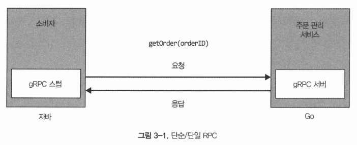

# gRPC 써보기

### RPC란?

외부 서비스의 메소드를 프록시를 통해 로컬 함수(시스템 내부 함수)에서 호출하는 것처럼 만들어주는 도구이다.

gRPC는 Google에서 개발한 오픈소스 원격 프로시저 호출(RPC) 프레임워크로, HTTP/2 기반의 고성능 통신을 제공한다.

---
## 목차

1. proto 파일 작성
2. 의존성 설정
3. gRPC 서버 구현
4. gRPC 클라이언트 구현
5. 빌드 및 실행
6. Spring 확장

---

## 0. gRPC의 주요 구성 요소

- .proto 파일을 작성한다 → (proto)

- protoc로 컴파일한다 → Protobuf 도구 체계

- 생성된 코드가 메시지를 직렬화/역직렬화한다 → Protobuf 포맷/런타임

- gRPC는 .proto의 service/rpc 정의를 사용해 Stub/서버 스켈레톤을 만든다

---

## 1. gRPC에서  proto의 역할


`proto`(Protocol Buffers IDL)는 Interface Definition Language의 한 종류로, gRPC에서 계약(Contract) 역할을 한다.

즉, 클라이언트와 서버가 **무엇을 호출할 수 있고(rpc), 어떤 데이터 형식으로 주고받는지(message)** 를 한 파일로 명확히 정의하고, 이를 기반으로 각 언어별 **코드가 자동 생성**된다.

### 1) 서비스 인터페이스 정의

`service`와 `rpc`로 “원격 호출 가능한 메서드”의 목록과 시그니처를 정의할 수 있다.

* 예시

  ```proto
  service Greeter {
    rpc SayHello (HelloRequest) returns (HelloReply) {}
  }
  ```

  → `Greeter`라는 서비스에 `SayHello`라는 unary RPC가 있고, 요청은 `HelloRequest`, 응답은 `HelloReply`라는 의미이다.

### 2) 메시지 스키마 정의

`message`로 요청/응답 데이터 구조를 정의한다.

gRPC는 이 스키마를 기반으로 **직렬화/역직렬화**를 수행한다.

* 예시

  ```proto
  message HelloRequest { string name = 1; }
  message HelloReply { string message = 1; }
  ```

  여기서 `= 1`, `= 2` 같은 숫자는 **필드 번호(tag)** 로, 바이너리 인코딩과 호환성 유지에 핵심이다.

### 3) 코드 자동 생성의 입력

`protoc`(컴파일러)와 gRPC 플러그인이 `.proto`를 읽어 다음을 생성한다.

* 서버 측: 서비스 인터페이스/베이스 클래스(구현용), 메시지 클래스
* 클라이언트 측: Stub(호출용), 메시지 클래스

즉, `.proto`는 “사람이 작성하는 정의”이고, 실제 런타임에서 쓰는 코드는 “생성된 코드”이다.

### 4) 언어/플랫폼 독립성 확보

Java, Go, Node, Python 등 서로 다른 언어 간에도 동일한 `.proto`로 통신 계약을 공유할 수 있다. 

> 이는 마이크로서비스 환경에서 특히 중요하다.
> 
> 서로 다른 언어로 작성된 서비스들이 gRPC를 통해 원활히 상호작용할 수 있기 때문이다.

### 5) 호환성 있는 진화(Versioning) 지원

필드 번호(tag) 기반으로 메시지를 확장/변경할 때 하위 호환성을 유지하기 쉽다.

* gRPC는 "변수 이름"이 아닌 "필드 번호"로 데이터를 식별함
* 새 필드는 새 번호로 추가
* 기존 번호 재사용은 피함
* 제거는 “삭제”보다 “reserved”로 관리하는 방식이 일반적
```proto
message HelloRequest {
  reserved 2, 3;
  reserved "oldFieldName";
  string name = 1;
}
```
### 각 옵션들의 의미

```proto
option java_multiple_files = true;
option java_package = "com.example.grpc.helloworld";
option java_outer_classname = "HelloWorldProto";
package helloworld;
```

* `java_multiple_files = true`: 메시지/서비스 타입이 **여러 Java 파일로 분리 생성**
* `java_package`: 생성되는 Java 코드의 패키지 지정(실제 Java namespace)
* `java_outer_classname`: multiple_files가 false일 때 주로 의미가 크지만, 생성되는 외부 클래스명에 영향이 있을 수 있음
* `package helloworld`: proto 내부 패키지(Proto namespace). 언어별 패키지/네임스페이스 매핑과 별개로 “proto 타입의 논리적 이름”을 구성

---

## 3. 서버 코드 작성
```java
package me.example.helloworld;

import io.grpc.Server;
import io.grpc.ServerBuilder;
import io.grpc.stub.StreamObserver;

import java.io.IOException;

public class HelloServer {

    static class GreeterImpl extends GreeterGrpc.GreeterImplBase {
        @Override
        public void sayHello(HelloRequest request, StreamObserver<HelloReply> responseObserver) {
            String name = request.getName();
            String message = "Hello, " + name;

            HelloReply reply = HelloReply.newBuilder().setMessage(message).build();

            responseObserver.onNext(reply);
            responseObserver.onCompleted();
        }
    }

    private Server server;

    private void start() throws IOException {
        int port = 50051;
        server = ServerBuilder.forPort(port)
                .addService(new GreeterImpl())
                .build()
                .start();

        System.out.println("Server started, listening on " + port);

        Runtime.getRuntime().addShutdownHook(new Thread(() -> {
            System.err.println("*** shutting down gRPC server");
            HelloServer.this.stop();
            System.err.println("*** server shut down");
        }));
    }

    private void stop(){
        if(server != null){
            server.shutdown();
        }
    }

    private void blockUntilShutdown() throws InterruptedException {
        if (server != null) {
            server.awaitTermination();
        }
    }

    public static void main(String[] args) throws IOException, InterruptedException {
        final HelloServer server = new HelloServer();
        server.start();
        server.blockUntilShutdown();
    }
}

```

---

## 4. 클라이언트 코드 작성

```java
package me.example.helloworld;

import io.grpc.ManagedChannel;
import io.grpc.ManagedChannelBuilder;
import io.grpc.StatusRuntimeException;

import java.util.concurrent.TimeUnit;

public class HelloClient {
    private final ManagedChannel channel;
    private final GreeterGrpc.GreeterBlockingStub blockingStub;

    public HelloClient(String host, int port) {
        this.channel = ManagedChannelBuilder.forAddress(host, port).usePlaintext().build();
        blockingStub = GreeterGrpc.newBlockingStub(channel);
    }

    public void shutdown() throws InterruptedException {
        channel.shutdown().awaitTermination(5, TimeUnit.SECONDS);
    }

    public void greet(String name) {
        System.out.println("Will try to greet " + name + " ...");
        HelloRequest request = HelloRequest.newBuilder().setName(name).build();
        HelloReply response;

        try {
            response = blockingStub.sayHello(request);
        } catch (StatusRuntimeException e) {
            System.err.println("RPC failed: " + e.getStatus());
            return;
        }
        System.out.println("Greeting: " + response.getMessage());
    }

    public static void main(String[] args) throws InterruptedException {
        String user = "world";
        if (args.length > 0) {
            user = args[0];
        }

        HelloClient client = new HelloClient("localhost", 50051);
        try {
            client.greet(user);
        } finally {
            client.shutdown();
        }
    }
}

```
5. 빌드 및 실행


---

6. Spring 에서 사용해보기

컨트롤러가 직접 서비스를 호출하지 않고, gRPC 클라이언트를 통해 원격 서비스를 호출하도록 구현해보았다.

- 서버 초기화
```java
package me.example.helloworld.compnent;

import io.grpc.Server;
import io.grpc.netty.NettyServerBuilder;
import me.example.helloworld.service.GreeterService;
import org.springframework.beans.factory.annotation.Value;
import org.springframework.context.SmartLifecycle;
import org.springframework.stereotype.Component;

import java.io.IOException;

@Component
public class GrpcServerLifecycle implements SmartLifecycle {
  private final Server server;
  private volatile boolean running = false;

  public GrpcServerLifecycle(GreeterService greeterService, @Value("${grpc.port:50051}") int port) {
    this.server = NettyServerBuilder.forPort(port)
            .addService(greeterService)
            .build();
  }
  @Override
  public void start() {
    try {
      server.start();
      running = true;
    } catch (IOException e){
      throw new IllegalStateException("Failed to start grpc server", e);
    }
  }

  @Override
  public void stop() {
    server.shutdown();
    running = false;
  }

  @Override
  public boolean isRunning() {
    return running;
  }

  @Override
  public int getPhase() {
    return Integer.MAX_VALUE;
  }
}
```

- 클라이언트를 위한 stub 생성
```java
package me.example.helloworld.config;

import io.grpc.ManagedChannel;
import io.grpc.ManagedChannelBuilder;
import me.example.helloworld.GreeterGrpc;
import org.springframework.beans.factory.annotation.Value;
import org.springframework.context.annotation.Bean;
import org.springframework.context.annotation.Configuration;

@Configuration
public class GrpcClientConfig {
  @Bean(destroyMethod = "shutdown")
  public ManagedChannel managedChannel(
          @Value("${grpc.client.host:localhost}") String host,
          @Value("${grpc.client.port:50051}") int port
  ) {
    return ManagedChannelBuilder
            .forAddress(host, port)
            .usePlaintext()
            .build();
  }

  @Bean
  public GreeterGrpc.GreeterBlockingStub greeterBlockingStub(ManagedChannel channel) {
    return GreeterGrpc.newBlockingStub(channel);
  }
}

```

- 서비스 구현
```java
package me.example.helloworld.service;

import io.grpc.stub.StreamObserver;
import me.example.helloworld.GreeterGrpc;
import me.example.helloworld.HelloReply;
import me.example.helloworld.HelloRequest;
import org.springframework.stereotype.Service;

@Service
public class GreeterService extends GreeterGrpc.GreeterImplBase {
    @Override
    public void sayHello(HelloRequest request, StreamObserver<HelloReply> responseObserver) {
        String message = "Hello, " + request.getName();

        HelloReply reply = HelloReply.newBuilder().setMessage(message).build();

        responseObserver.onNext(reply);
        responseObserver.onCompleted();
    }
}
```
- 컨트롤러 구현
```java
package me.example.helloworld.controller;

import me.example.helloworld.GreeterGrpc;
import me.example.helloworld.HelloReply;
import me.example.helloworld.HelloRequest;
import org.springframework.web.bind.annotation.GetMapping;
import org.springframework.web.bind.annotation.RequestParam;
import org.springframework.web.bind.annotation.RestController;

import java.util.Map;

@RestController
public class GreeterController {
    private final GreeterGrpc.GreeterBlockingStub stub;

    public GreeterController(GreeterGrpc.GreeterBlockingStub stub) {
        this.stub = stub;
    }

    @GetMapping("/api/hello")
    public Map<String, String> sayHello(@RequestParam String name) {
        HelloReply reply = stub.sayHello(HelloRequest.newBuilder().setName(name).build());
        return Map.of("message", reply.getMessage());
    }
}

```


- 구현 결과

---

## gRPC 내부 동작 이해하기

출처: [kt cloud 기술 블로그 - gRPC의 내부 구조 파헤치기](https://tech.ktcloud.com/entry/gRPC의-내부-구조-파헤치기-HTTP2-Protobuf-그리고-스트리밍)


gRPC는 HTTP/2 프로토콜을 기반으로 하기 때문에, HTTP/2.0의 주요 특징들을 알고 있으면 이해하는 데 도움이 된다.

추천하는 글:
- [HTTP/2.0과 HTTP/3.0의 등장 배경](https://go-gradually.tistory.com/entry/HTTP20-HTTP-%EB%A9%80%ED%8B%B0%ED%94%8C%EB%A0%89%EC%8B%B1-HoL-Blocking-%EA%B7%B8%EB%A6%AC%EA%B3%A0-HTTP30%EC%9D%98-%EB%93%B1%EC%9E%A5-%EB%B0%B0%EA%B2%BD)


### Unary



- REST와 마찬가지로 1:1 요청-응답 방식이다.

- Unary RPC의 경우에도 HTTP/2 멀티플렉싱을 활용하므로, 여러 개의 요청을 하나의 TCP 연결로 처리할 수 있다.


### Server Streaming RPC


- 클라이언트 단일 요청에 대해 서버가 여러 개의 응답을 순차적으로 스트리밍한다.

- HTTP/2 서버 푸시와 유사하며, 로그나 실시간 데이터 전송에 유리하다.


### Client Streaming RPC


- 클라이언트가 여러 데이터를 순차적으로 전송하고, 서버가 한 번의 응답을 반환한다.

- 대용량 데이터 업로드 시 유용하다.


### Bidirectional Streaming RPC


- 클라이언트와 서버가 동시에 데이터를 주고받을 수 있는 양방향 스트리밍을 제공한다.

- HTTP/2의 비동기 멀티플렉싱 덕분에 순서에 구애받지 않고 데이터를 주고받을 수 있다.

- 실시간 채팅 등 지속적인 데이터 교환 시 유리하다.